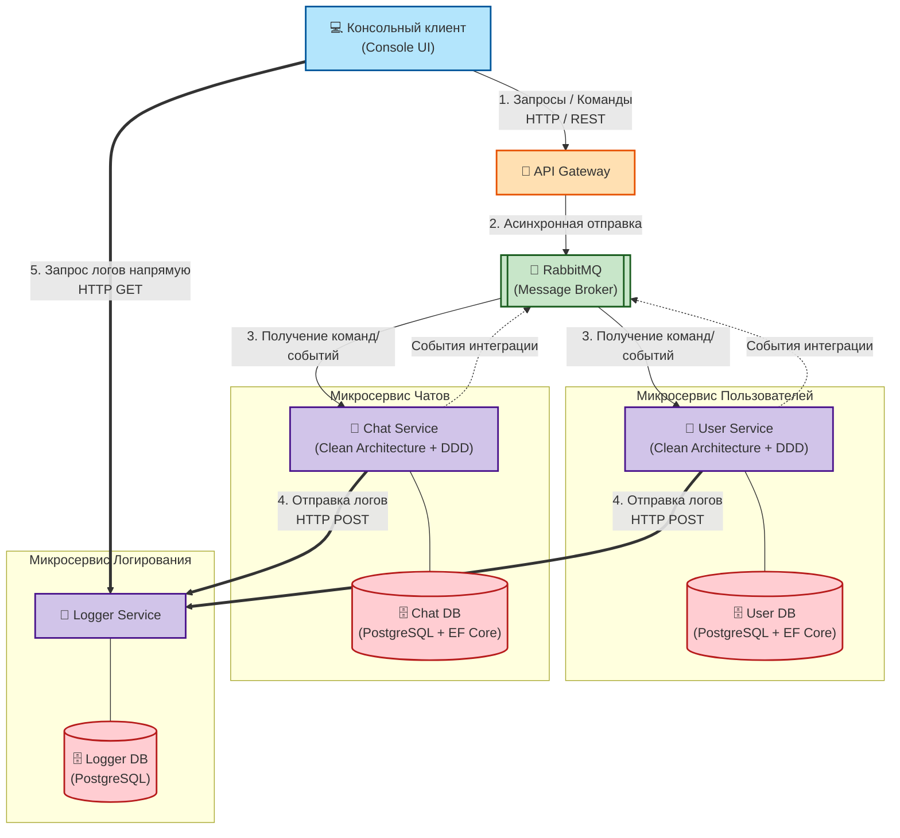

```mermaid
graph TD
    %% Стилизация компонентов
    classDef client fill:#b3e5fc,stroke:#01579b,stroke-width:2px;
    classDef gateway fill:#ffe0b2,stroke:#e65100,stroke-width:2px;
    classDef service fill:#d1c4e9,stroke:#4a148c,stroke-width:2px;
    classDef broker fill:#c8e6c9,stroke:#1b5e20,stroke-width:2px;
    classDef db fill:#ffcdd2,stroke:#b71c1c,stroke-width:2px;

    %% Описание узлов системы
    Client["💻 Консольный клиент<br>(Console UI)"]:::client
    Gateway["🔀 API Gateway"]:::gateway
    
    RabbitMQ[["🐇 RabbitMQ<br>(Message Broker)"]]:::broker

    subgraph UserMicroservice ["Микросервис Пользователей"]
        UserService["👤 User Service<br>(Clean Architecture + DDD)"]:::service
        UserDB[("🗄️ User DB<br>(PostgreSQL + EF Core)")]:::db
    end

    subgraph ChatMicroservice ["Микросервис Чатов"]
        ChatService["💬 Chat Service<br>(Clean Architecture + DDD)"]:::service
        ChatDB[("🗄️ Chat DB<br>(PostgreSQL + EF Core)")]:::db
    end

    subgraph LoggerMicroservice ["Микросервис Логирования"]
        LoggerService["📜 Logger Service"]:::service
        LoggerDB[("🗄️ Logger DB<br>(PostgreSQL)")]:::db
    end

    %% Взаимодействия и транспорт (Бизнес-логика)
    Client -->|1. Запросы / Команды<br>HTTP / REST| Gateway
    Gateway -->|2. Асинхронная отправка| RabbitMQ
    
    RabbitMQ -->|3. Получение команд/событий| UserService
    RabbitMQ -->|3. Получение команд/событий| ChatService
    
    %% Межсервисные события через брокер
    UserService -.->|События интеграции| RabbitMQ
    ChatService -.->|События интеграции| RabbitMQ

    %% Связи с базами данных
    UserService --- UserDB
    ChatService --- ChatDB
    LoggerService --- LoggerDB
    
    %% ЛОГИРОВАНИЕ И ЧТЕНИЕ ЛОГОВ (HTTP REST)
    UserService ==>|4. Отправка логов<br>HTTP POST| LoggerService
    ChatService ==>|4. Отправка логов<br>HTTP POST| LoggerService
    Client ==>|5. Запрос логов напрямую<br>HTTP GET| LoggerService
```
