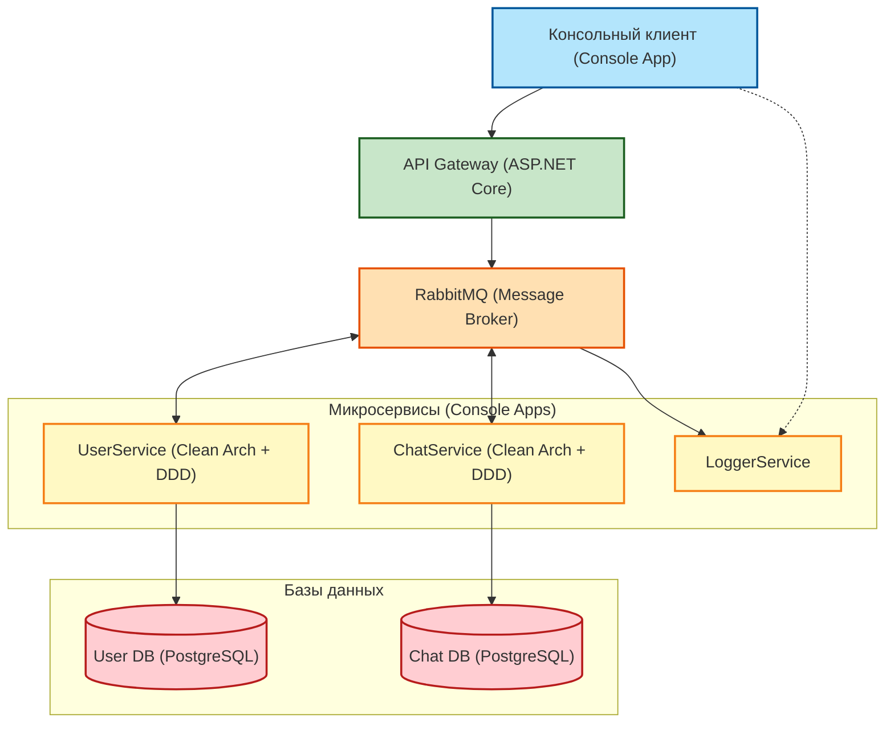

```mermaid
graph TD
    classDef client fill:#b3e5fc,stroke:#01579b,stroke-width:2px;
    classDef gateway fill:#c8e6c9,stroke:#1b5e20,stroke-width:2px;
    classDef service fill:#fff9c4,stroke:#f57f17,stroke-width:2px;
    classDef broker fill:#ffe0b2,stroke:#e65100,stroke-width:2px;
    classDef db fill:#ffcdd2,stroke:#b71c1c,stroke-width:2px;

    Client["Консольный клиент (Console App)"]:::client
    Gateway["API Gateway (ASP.NET Core)"]:::gateway
    
    subgraph Microservices ["Микросервисы (Console Apps)"]
        UserSvc["UserService (Clean Arch + DDD)"]:::service
        ChatSvc["ChatService (Clean Arch + DDD)"]:::service
        LogSvc["LoggerService"]:::service
    end

    Rabbit["RabbitMQ (Message Broker)"]:::broker

    subgraph Storage ["Базы данных"]
        UserDB[("User DB (PostgreSQL)")]:::db
        ChatDB[("Chat DB (PostgreSQL)")]:::db
    end

    Client --> Gateway
    Client -.-> LogSvc
    
    Gateway --> Rabbit
    
    Rabbit <--> UserSvc
    Rabbit <--> ChatSvc
    Rabbit --> LogSvc

    UserSvc --> UserDB
    ChatSvc --> ChatDB
```
