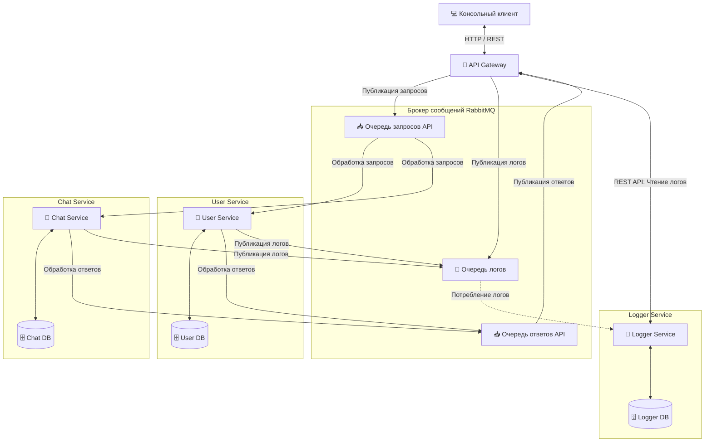

```mermaid
flowchart TD
    %% Консольный клиент и API Gateway
    Client[💻 Консольный клиент] <-->|HTTP / REST| Gateway[🚪 API Gateway]

    %% RabbitMQ Брокер сообщений
    subgraph RabbitMQ [ Брокер сообщений RabbitMQ ]
        ReqQueue[📥 Очередь запросов API]
        AnsQueue[📥 Очередь ответов API]
        LogQueue[📝 Очередь логов]
    end

    %% Связь API Gateway с RabbitMQ
    Gateway -->|Публикация запросов| ReqQueue

    %% Связь API Gateway с RabbitMQ
    AnsQueue -->|Публикация ответов| Gateway

    %% Микросервисы и их БД
    subgraph US_Block [User Service]
        US[👤 User Service] <---> US_DB[(🗄️ User DB)]
    end

    subgraph CS_Block [Chat Service]
        CS[💬 Chat Service] <---> CS_DB[(🗄️ Chat DB)]
    end

    subgraph LS_Block [Logger Service]
        LS[📜 Logger Service] <---> LS_DB[(🗄️ Logger DB)]
    end

    %% Подписки сервисов на очереди
    ReqQueue --->|Обработка запросов| US
    ReqQueue --->|Обработка запросов| CS

    %% Ответы сервисов
    US --->|Обработка ответов| AnsQueue
    CS --->|Обработка ответов| AnsQueue

    %% Публикация логов в очередь
    US -->|Публикация логов| LogQueue
    CS -->|Публикация логов| LogQueue
    Gateway -->|Публикация логов| LogQueue

    %% Чтение логов и REST API для них
    LogQueue -.->|Потребление логов| LS
    Gateway <-->|REST API: Чтение логов| LS
```

