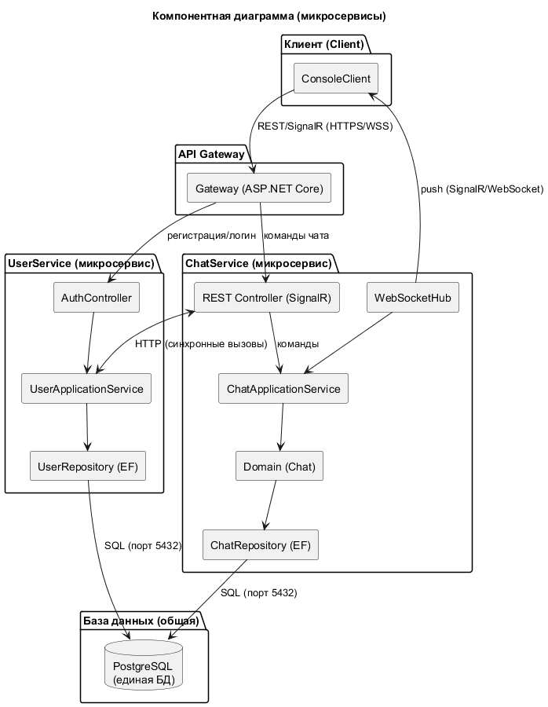
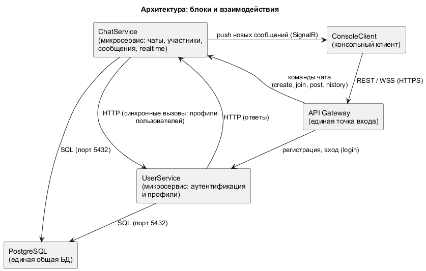
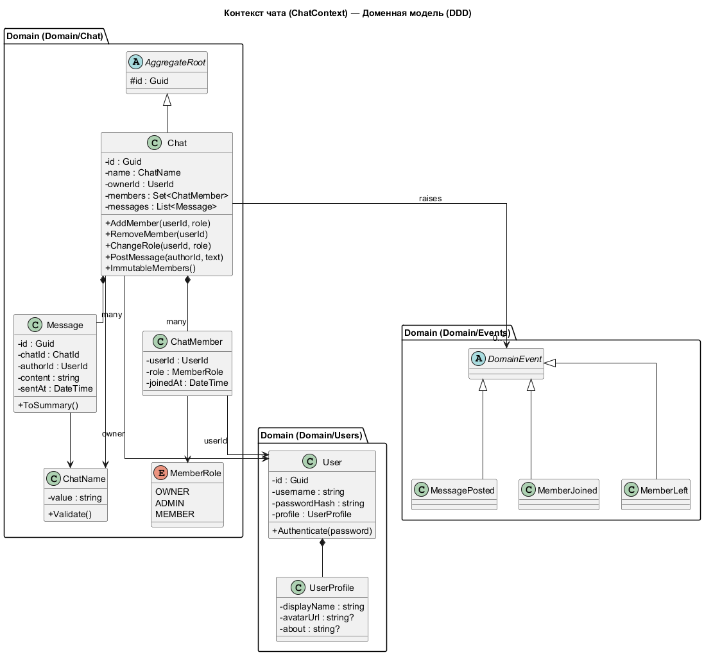
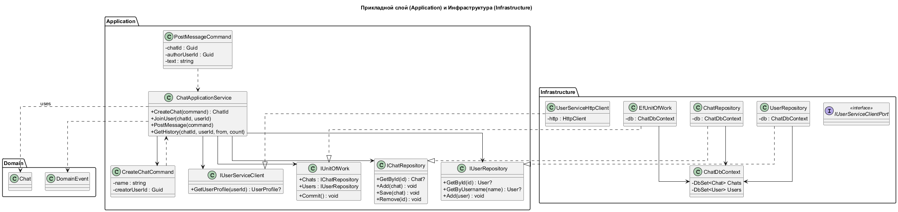
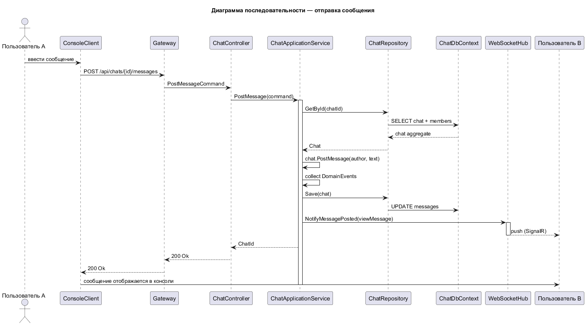
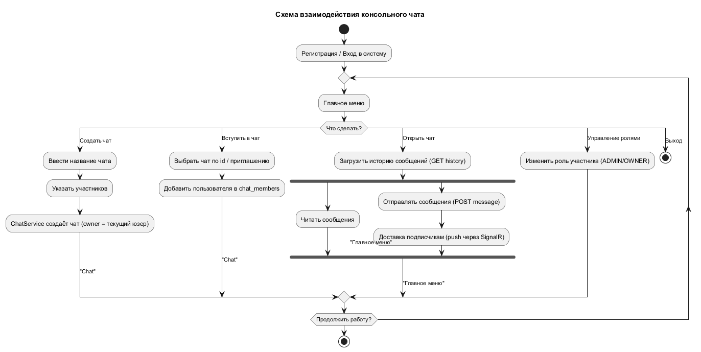
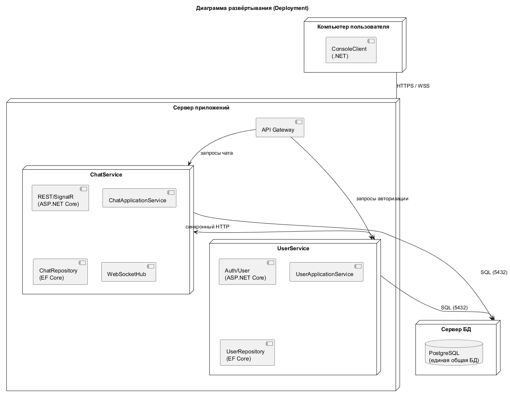
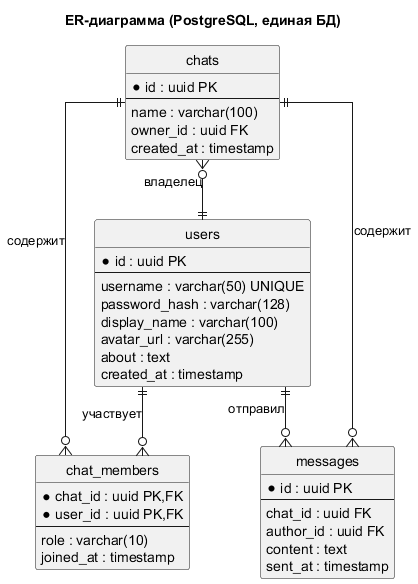

# Архитектура консольного чата (полная)

Стек: **C# / .NET**, DDD, микросервисы, многопоточность, PostgreSQL (единая БД).
Межсервисное взаимодействие — **синхронные HTTP-вызовы** (без брокера сообщений).

---

## 1. Общая схема (микросервисы)

- **ConsoleClient** — консольный клиент пользователя.
- **API Gateway** — единая точка входа (маршрутизация команд).
- **ChatService** — управление чатами, участниками, сообщениями, реальным временем.
- **UserService** — аутентификация и профили.
- **PostgreSQL** — **единая общая БД**, используемая обоими сервисами (без RabbitMQ).

Сервисы общаются напрямую по HTTP (например, ChatService запрашивает профили пользователей у UserService).

### Блоки и взаимодействия

Каждый компонент — отдельный блок (клиент, API Gateway, микросервисы, БД),
стрелки показывают каналы взаимодействия между ними:

---

## 2. Разбиение на слои (DDD + чистая архитектура)

Проект разбит на слои внутри каждого сервиса:

| Слой | Содержимое | Зависит от |
|------|-----------|-----------|
| **Presentation/API** | REST-контроллеры, WebSocket/SignalR-хаб, DTO | Application |
| **Application** | Use-case сервисы, команды, интерфейсы портов, Unit of Work | Domain |
| **Domain** | Сущности, агрегаты, value objects, доменные события, репозитории (интерфейсы) | — |
| **Infrastructure** | EF Core, репозитории, HTTP-клиенты для вызова другого сервиса | Domain, Application (порты) |

---

## 3. Доменная модель

Выделены два bounded-контекста: **Users** и **Chat**.

### Контекст Chat (агрегат `Chat`)

Агрегат `Chat` управляет инвариантами: состав участников, роли, сообщения.
Внутри агрегата — `ChatMember`, `Message`, `ChatName` (value object), `MemberRole` (enum).
Агрегат порождает доменные события: `MessagePosted`, `MemberJoined`, `MemberLeft`.

### Контекст Users (агрегат `User`)

Агрегат `User` содержит учётные данные (`UserProfile`, пароль) и метод проверки аутентификации.

---

## 4. Прикладной слой (Application)

Use-case сервисы (`ChatApplicationService`) получают команды, применяют их к агрегатам
и сохраняют через репозитории. Доменные события обрабатываются **внутри того же сервиса**
(in-process), а не через шину.

Порты (интерфейсы): `IChatRepository`, `IUserRepository`, `IUnitOfWork`, а для вызова
другого сервиса — `IUserServiceClient` (реализация — HTTP-клиент в Infrastructure).

---

## 5. Поток «отправка сообщения» (диаграмма последовательностей)

Пользователь отправляет сообщение → команда проходит через Gateway → ChatService применяет
команду к агрегату `Chat` и сохраняет → WebSocket-хаб уведомляется **в том же процессе**
и пушит сообщение подписанным участникам.

### Общая схема взаимодействия (блок-схема)

Наглядное представление основных потоков пользователя в виде блоков и стрелок
(создание чата, вступление, обмен сообщениями, управление ролями):

---

## 6. Многопоточность и реальное время

- **Асинхронная обработка команд** — `async/await`, `Task` для параллельной работы нескольких клиентов.
- **WebSocket/SignalR Hub** — держит соединения с подключёнными консольными клиентами и пушит новые сообщения.
- **Пул соединений БД** — конкурентный доступ к PostgreSQL (порт 5432).

Отдельной фоновой обработки очередей нет — realtime-уведомления происходят напрямую через хаб.

---

## 7. Межсервисное взаимодействие

RabbitMQ не используется. Сервисы общаются **синхронно по HTTP**:

- **ChatService → UserService**: получить профили/проверить пользователей (например, при показе участников чата).
- Realtime-уведомления внутри ChatService — напрямую: application-слой уведомляет
  WebSocket-хаб (in-process), без очередей.

Синхронная связь проще в реализации и отладке, но добавляет временную связанность между
сервисами — она компенсируется таймаутами, ретраями и локальным кэшем данных пользователей.

Общие данные хранятся в одной БД, поэтому согласованность обеспечивается на уровне
БД/транзакций (Unit of Work), а не через компенсации событий.

---

## 8. Развёртывание (Deployment)

---

## 9. Модель данных (ER)

`outbox` отсутствует (нет брокера). Вся схема — общая для обоих сервисов.

Основные сущности:

- `users` — пользователи, учётные данные, профиль.
- `chats` — чаты, владелец.
- `chat_members` — состав участников и их роли.
- `messages` — сообщения.

---

## 10. Архитектурные принципы

1. **Dependency Inversion** — Domain не зависит от Infrastructure; Infrastructure реализует порты.
2. **Агрегаты** — единственная точка изменения инвариантов; репозитории работают только с агрегатами.
3. **Команды идут синхронно по REST**; realtime-доставка — через WebSocket-хаб in-process.
4. **Единая БД** — оба сервиса работают с одной схемой; консистентность — транзакции/Unit of Work.
5. **Синхронные HTTP-вызовы** между сервисами защищены таймаутами, ретраями и кэшируются.