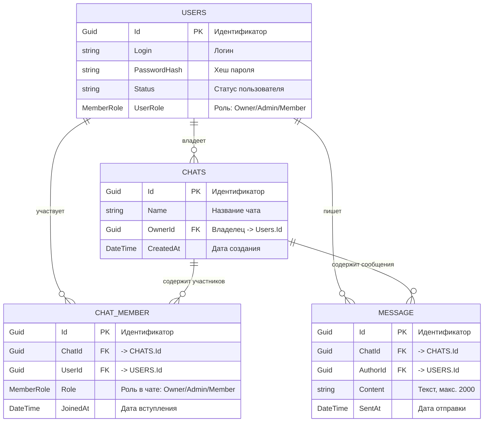

# ChatService — ER-диаграмма (Domain.Entities)

Источник: `git_repo\BlackBox\ChatService\Domain\Domain.Entities`

## Диаграмма (Mermaid)

## Связи и кардинальности

| Отношение | Тип | Пояснение |
|---|---|---|
| `USERS` -> `CHATS` | 1 : N | Один пользователь владеет многими чатами. FK: `Chat.OwnerId` |
| `USERS` -> `CHAT_MEMBER` | 1 : N | Один пользователь — много участий в чатах. FK: `ChatMember.UserId` |
| `USERS` -> `MESSAGE` | 1 : N | Один пользователь пишет много сообщений. FK: `Message.AuthorId` |
| `CHATS` -> `CHAT_MEMBER` | 1 : N | Один чат — много участников. FK: `ChatMember.ChatId` |
| `CHATS` -> `MESSAGE` | 1 : N | Один чат — много сообщений. FK: `Message.ChatId` |

## Сущности и поля

### Users
| Поле | Тип | Ограничения | Описание |
|---|---|---|---|
| Id | Guid | PK | Идентификатор |
| Login | string | — | Логин |
| PasswordHash | string | — | Хеш пароля |
| Status | string | — | Статус пользователя |
| UserRole | MemberRole | enum | Роль пользователя |

### Chat
| Поле | Тип | Ограничения | Описание |
|---|---|---|---|
| Id | Guid | PK | Идентификатор |
| Name | string | — | Название чата |
| OwnerId | Guid | FK -> Users.Id | Владелец |
| CreatedAt | DateTime | — | Дата создания |
| Members | List\<ChatMember\> | navigation | Участники чата |
| Messages | List\<Message\> | navigation | Сообщения чата |

### ChatMember
| Поле | Тип | Ограничения | Описание |
|---|---|---|---|
| Id | Guid | PK | Идентификатор |
| ChatId | Guid | FK -> Chat.Id | Чат |
| UserId | Guid | FK -> Users.Id | Пользователь |
| Role | MemberRole | enum | Роль в чате |
| JoinedAt | DateTime | — | Дата вступления |

### Message
| Поле | Тип | Ограничения | Описание |
|---|---|---|---|
| Id | Guid | PK | Идентификатор |
| ChatId | Guid | FK -> Chat.Id | Чат |
| AuthorId | Guid | FK -> Users.Id | Автор |
| Content | string | макс. 2000 (`Message.MaxContentLength`) | Текст сообщения |
| SentAt | DateTime | — | Дата отправки |

### Enum: MemberRole
| Значение | Число |
|---|---|
| Owner | 0 |
| Admin | 1 |
| Member | 2 |

### Интерфейс IEntity<TId>
`Id : TId { get; set; }` — реализуется `Chat`, `ChatMember`, `Message` (`IEntity<Guid>`).

## Замечания

- `Users` не реализует `IEntity<Guid>` и не имеет публичных сеттеров (`private set`), в отличие от остальных сущностей.
- Навигационные свойства заданы только у `Chat` (`Members`, `Messages`); у `Users`, `ChatMember` и `Message` навигаций к связанным сущностям в коде нет — связь строится по FK.
- В `DatabaseContext.OnModelCreating` (`Infrastructure.EntityFramework`) `DbSet<Users>` не зарегистрирован; явно сконфигурирована только связь `Chat.HasMany(Messages)`. Связи с `Users` стоит описать явно через `HasOne(...).WithMany()` и `HasForeignKey(...)`.
- Уникальный индекс `(ChatId, UserId)` для `ChatMember` в коде не задан — без него возможны дубликаты участников.
- Поле `Users.Status` хранится как `string`, тогда как `UserRole` и `ChatMember.Role` используют enum `MemberRole` — смешение строковых и enum-подобных значений в одном домене.
